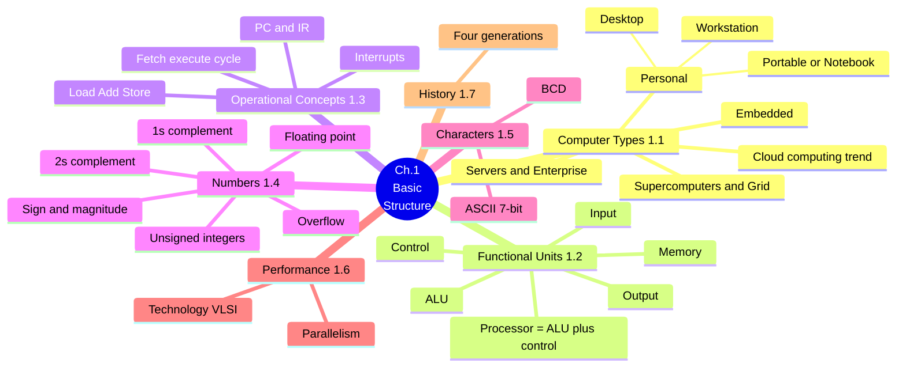
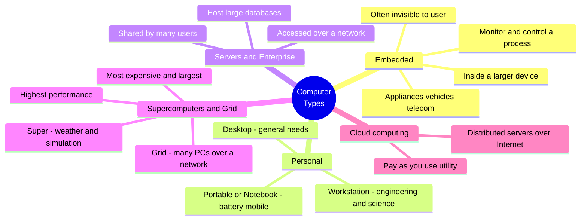
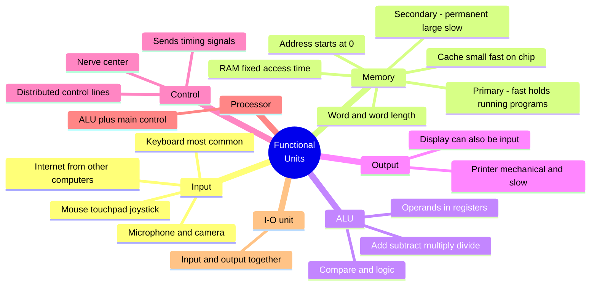
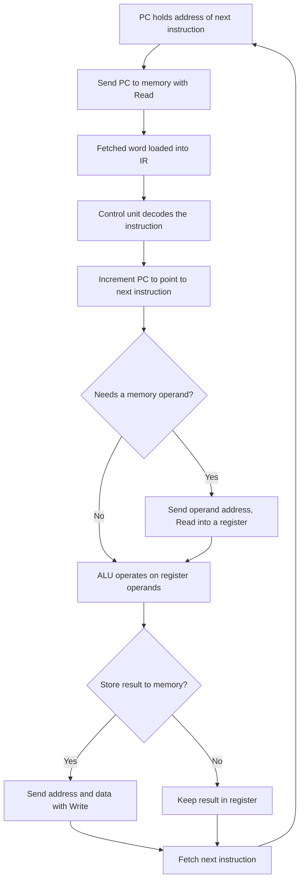
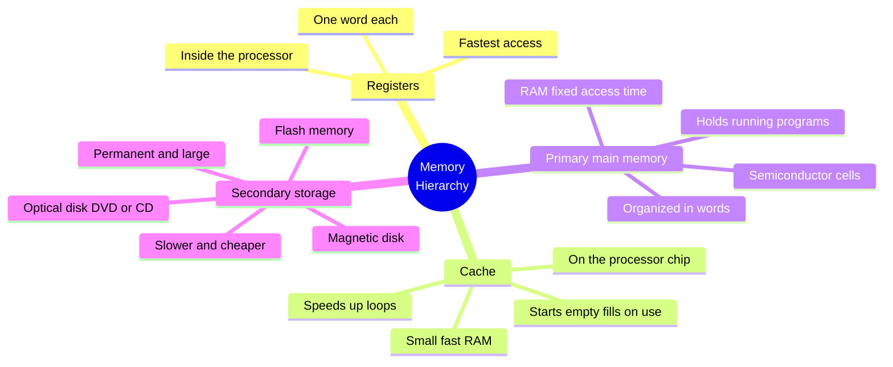
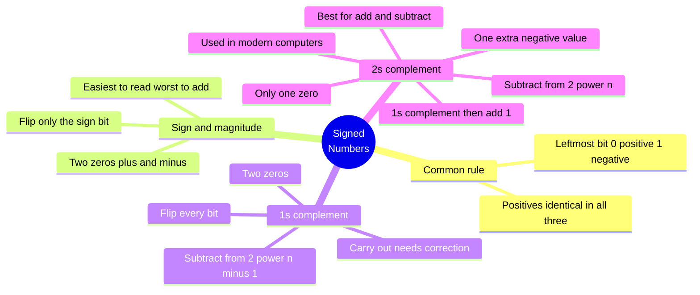
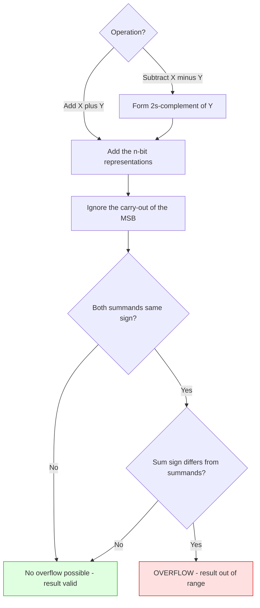
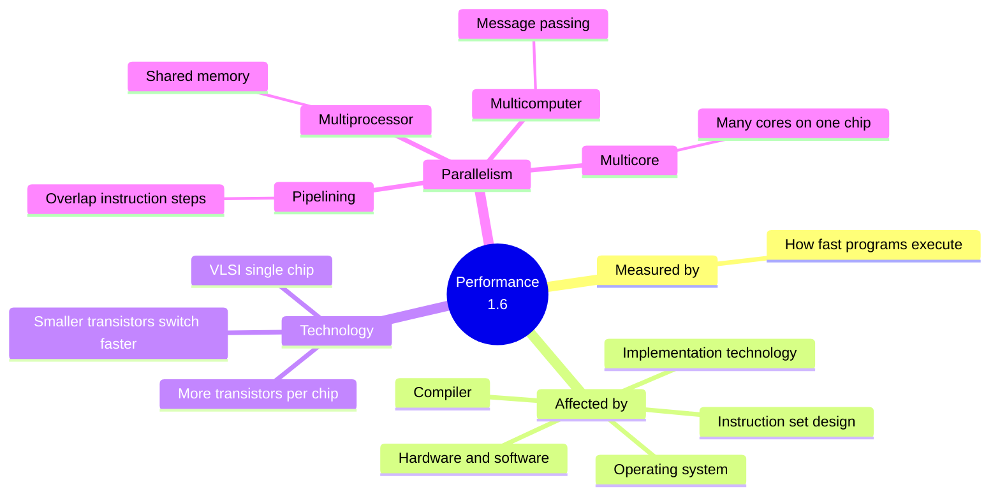
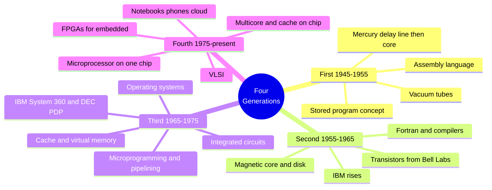

# Chapter 1 — Basic Structure of Computers · Mind Maps

**Companion to:** `Chapter1_Basic_Structure_StudyGuide.md`

> **How to view these:** The diagrams below use **Mermaid**, which renders as real
> pictures in VS Code (with a Markdown Mermaid extension), Obsidian, Typora, GitHub, and
> GitLab. If you open this file somewhere that *doesn't* render Mermaid, every diagram
> also has a plain-text **ASCII** version right underneath so nothing is lost.
>
> To export as an image/PDF: open in Obsidian or Typora → Export, or paste a single
> ```mermaid``` block into https://mermaid.live and download PNG/SVG.

---

## Table of Contents
1. [Master Map — The Whole Chapter](#1-master-map--the-whole-chapter)
2. [Computer Types](#2-computer-types)
3. [The Five Functional Units](#3-the-five-functional-units)
4. [The Fetch-Execute Cycle (flow)](#4-the-fetch-execute-cycle)
5. [The Memory Hierarchy](#5-the-memory-hierarchy)
6. [Signed-Number Systems](#6-signed-number-systems)
7. [2's-Complement Add and Subtract (flow)](#7-2s-complement-add-and-subtract)
8. [Performance and Parallelism](#8-performance-and-parallelism)
9. [The Four Generations](#9-the-four-generations)

---

## 1. Master Map — The Whole Chapter



**ASCII fallback:**
```
Ch.1 BASIC STRUCTURE
├── COMPUTER TYPES (1.1)
│   ├── Embedded · Personal (Desktop/Workstation/Portable) · Servers · Super+Grid
│   └── Cloud computing (emerging access trend)
├── FUNCTIONAL UNITS (1.2): Input · Memory · ALU · Output · Control
│   └── Processor = ALU + main control circuits
├── OPERATIONAL CONCEPTS (1.3): Load/Add/Store · fetch-execute · PC & IR · interrupts
├── NUMBERS (1.4): unsigned · sign-mag · 1s-comp · 2s-comp · overflow · floating point
├── CHARACTERS (1.5): ASCII 7-bit · BCD
├── PERFORMANCE (1.6): VLSI technology · parallelism
└── HISTORY (1.7): four generations
```

---

## 2. Computer Types



**ASCII fallback:**
```
COMPUTER TYPES
├── EMBEDDED        : inside a larger device, control a process, often invisible
├── PERSONAL        : Desktop(general) · Workstation(eng/sci) · Portable(battery/mobile)
├── SERVERS+ENTERPRISE : shared by many users over a network, host large databases
├── SUPER + GRID    : highest performance; Super=weather/simulation; Grid=many PCs networked
└── CLOUD COMPUTING : distributed servers over Internet, pay-as-you-use utility
```

---

## 3. The Five Functional Units



**ASCII fallback:**
```
FUNCTIONAL UNITS
├── INPUT   : keyboard(most common) · mouse/touchpad/joystick · mic/camera · Internet
├── MEMORY  : primary(fast, running programs) · secondary(permanent, large, slow)
│             word & word length · address from 0 · RAM(fixed access) · cache(small fast on-chip)
├── ALU     : add/sub/mul/div · compare · logic · operands held in registers
├── OUTPUT  : printer(mechanical, slow) · display(can also be input)
└── CONTROL : nerve center · timing signals · distributed control lines
Grouping: PROCESSOR = ALU + main control ;  I/O UNIT = input + output together
```

---

## 4. The Fetch-Execute Cycle

A **flow** map — the order of events running one instruction (Section 1.3, Example 1.1).



**ASCII fallback:**
```
FETCH-EXECUTE CYCLE
 1. PC holds address of next instruction
 2. Send PC to memory with a Read signal
 3. Fetched word loaded into IR
 4. Control unit decodes the instruction
 5. Increment PC -> points to next instruction
 6. Need a memory operand?
       Yes -> send operand address, Read it into a register
       No  -> skip
 7. ALU operates on the register operands
 8. Store result to memory?
       Yes -> send address + data with a Write signal
       No  -> keep result in a register
 9. Loop back to fetch the next instruction
```

---

## 5. The Memory Hierarchy



**ASCII fallback:**
```
MEMORY HIERARCHY  (fastest/smallest at top)
├── REGISTERS : inside processor, one word each, fastest
├── CACHE     : small fast RAM on chip, starts empty, speeds up loops
├── PRIMARY   : semiconductor cells in words, RAM fixed access, holds running programs
└── SECONDARY : permanent, large, slow, cheap - magnetic disk · optical DVD or CD · flash
```

---

## 6. Signed-Number Systems



**ASCII fallback:**
```
SIGNED NUMBERS  (leftmost bit: 0=positive, 1=negative; positives identical in all three)
├── SIGN-AND-MAGNITUDE : flip only the sign bit; two zeros; easy read, worst arithmetic
├── 1s COMPLEMENT      : flip every bit (= subtract from 2^n - 1); two zeros; carry needs fix
└── 2s COMPLEMENT      : 1s-complement + 1 (= subtract from 2^n); one zero; one extra negative;
                         best for add/subtract; used in modern computers
```

---

## 7. 2's-Complement Add and Subtract

A **flow** map — the rules and the overflow test.



**ASCII fallback:**
```
2's-COMPLEMENT ADD and SUBTRACT
  ADD X+Y        -> add the n-bit representations
  SUBTRACT X-Y   -> form 2's-complement of Y, THEN add it to X
  then: IGNORE the carry-out of the most significant bit

OVERFLOW TEST (addition):
  both summands same sign?
     No  -> no overflow possible, result valid
     Yes -> sum's sign differs from summands?
               No  -> valid
               Yes -> OVERFLOW (result out of representable range)
```

---

## 8. Performance and Parallelism



**ASCII fallback:**
```
PERFORMANCE (1.6)
├── MEASURED BY : how fast programs execute
├── AFFECTED BY : instruction set · hardware · software · OS · technology · compiler
├── TECHNOLOGY  : VLSI on one chip; smaller transistors switch faster; more per chip
└── PARALLELISM : pipelining(overlap steps) · multicore(cores/chip)
                  · multiprocessor(shared memory) · multicomputer(message passing)
```

---

## 9. The Four Generations



**ASCII fallback:**
```
FOUR GENERATIONS
├── FIRST  1945-1955 : vacuum tubes · stored-program concept · assembly · delay-line/core
├── SECOND 1955-1965 : transistors(Bell Labs) · core+disk · Fortran+compilers · IBM rises
├── THIRD  1965-1975 : integrated circuits · microprogramming/pipelining · OS
│                      · cache(seems faster) + virtual memory(seems larger) · S/360, PDP
└── FOURTH 1975-now  : VLSI · microprocessor on one chip · multicore+cache · FPGAs
                       · notebooks, phones, cloud
```

---

*End of mind maps. Pair this with the main study guide for full detail on each node.*
