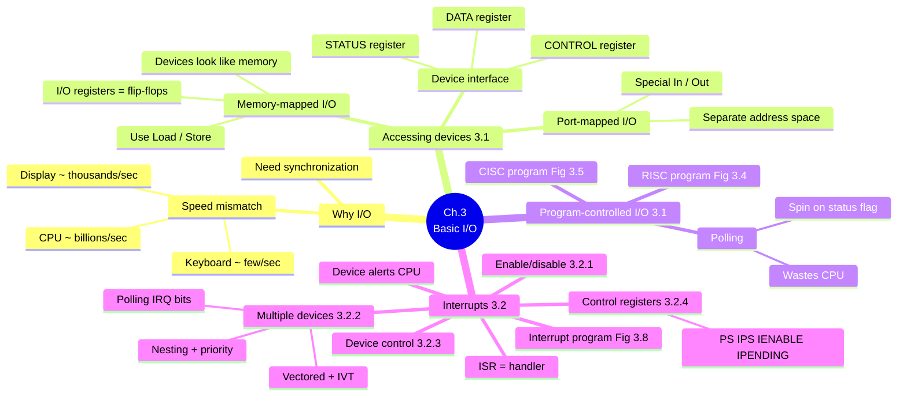
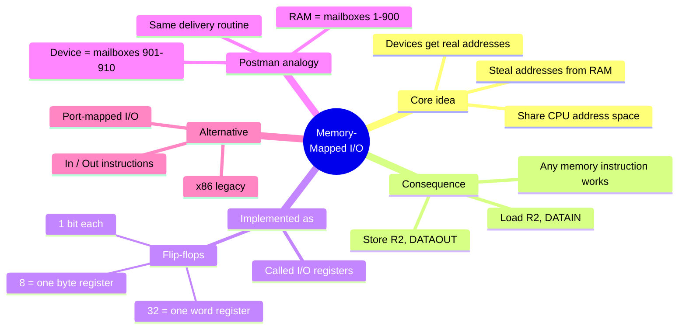
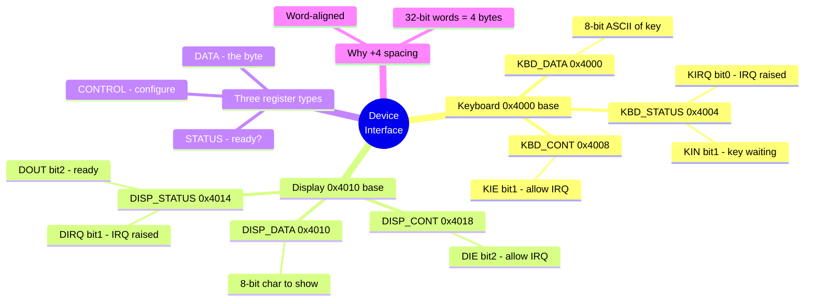
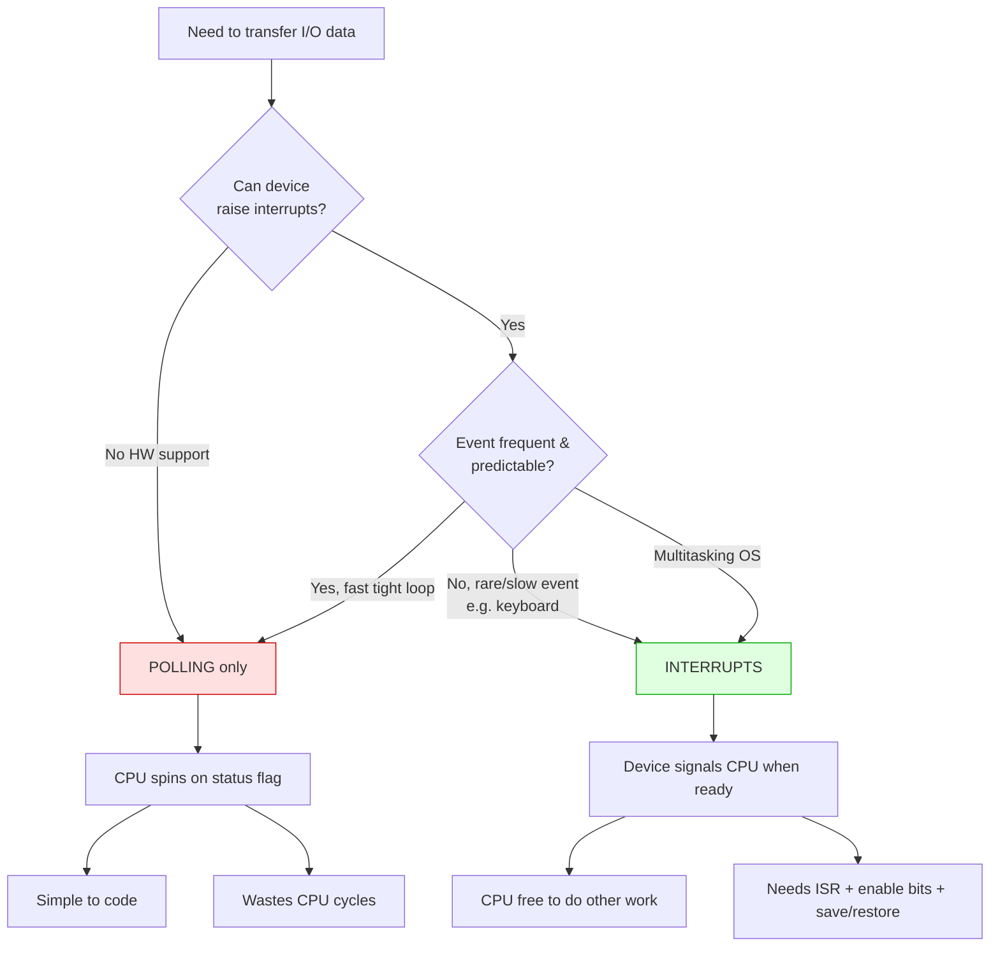
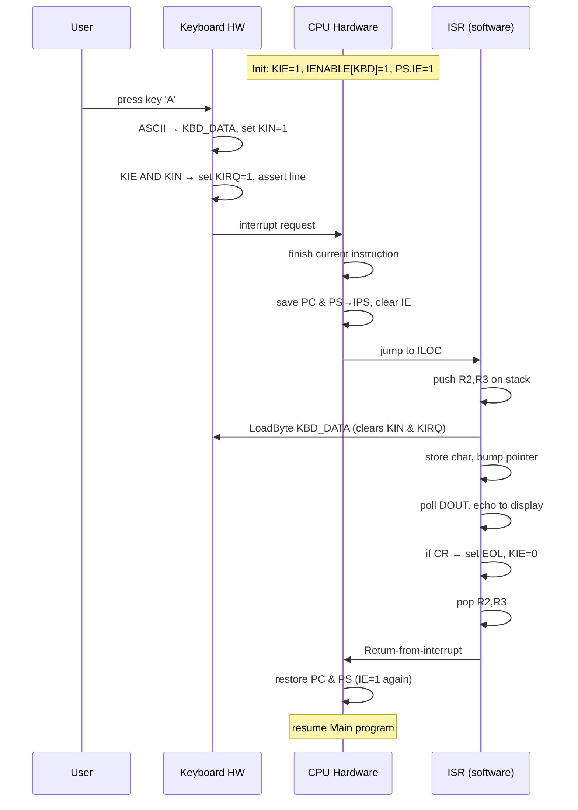
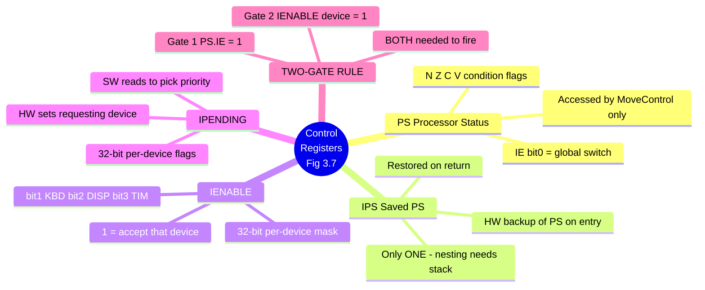
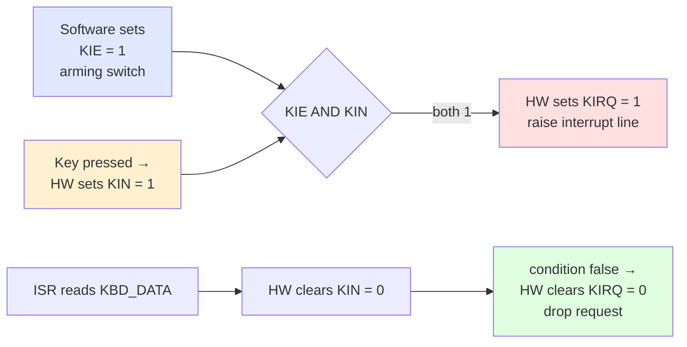
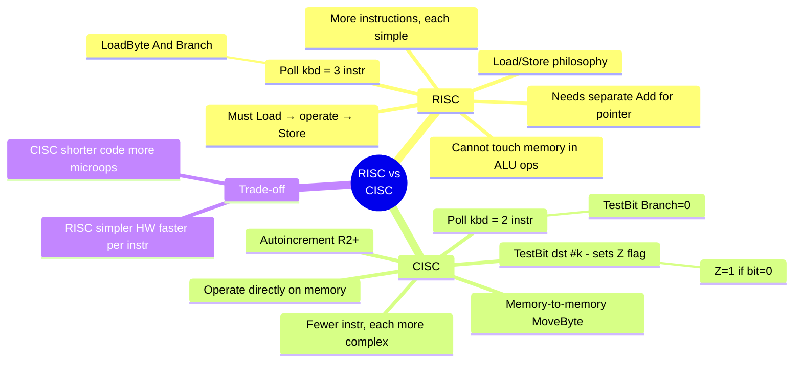
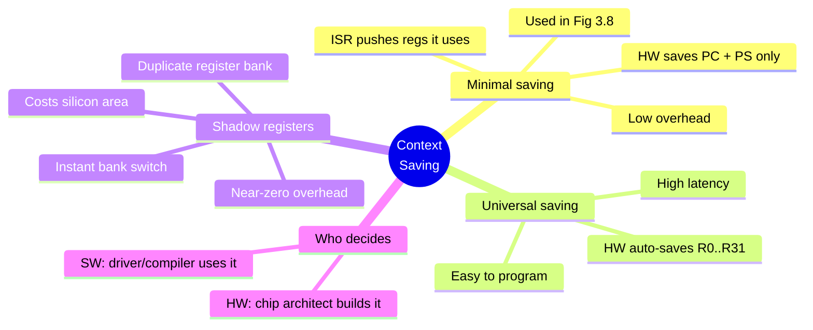

# Chapter 3 — Basic Input/Output · Mind Maps

**Companion to:** `Chapter3_Basic_Input_Output_StudyGuide.md`

> **How to view these:** The diagrams below use **Mermaid**, which renders as real
> pictures in VS Code (with a Markdown Mermaid extension), Obsidian, Typora, GitHub, and
> GitLab. If you open this file somewhere that *doesn't* render Mermaid, every diagram
> also has a plain-text **ASCII** version right underneath so nothing is lost.
>
> To export as an image/PDF: open in Obsidian or Typora → Export, or paste a single
> ```mermaid``` block into https://mermaid.live and download PNG/SVG.

---

## Table of Contents
1. [Master Map — The Whole Chapter](#1-master-map--the-whole-chapter)
2. [Memory-Mapped I/O](#2-memory-mapped-io)
3. [The Device Interface & Register Map](#3-the-device-interface--register-map)
4. [Polling vs Interrupts (decision)](#4-polling-vs-interrupts)
5. [The Interrupt Lifecycle (flow)](#5-the-interrupt-lifecycle)
6. [Processor Control Registers & the Two-Gate Rule](#6-processor-control-registers--the-two-gate-rule)
7. [The Keyboard Flag Logic (KIE · KIN · KIRQ)](#7-the-keyboard-flag-logic)
8. [RISC vs CISC](#8-risc-vs-cisc)
9. [Context Saving Strategies](#9-context-saving-strategies)

---

## 1. Master Map — The Whole Chapter



**ASCII fallback:**
```
Ch.3 BASIC I/O
├── WHY I/O
│   ├── Speed mismatch (kbd few/s · display thousands/s · CPU billions/s)
│   └── Need synchronization
├── ACCESSING DEVICES (3.1)
│   ├── Memory-mapped I/O → devices look like memory, use Load/Store
│   ├── Port-mapped I/O   → special In/Out, separate space
│   └── Device interface  → DATA · STATUS · CONTROL registers
├── PROGRAM-CONTROLLED I/O (3.1)  [Polling]
│   ├── Spin on a status flag (wastes CPU)
│   ├── RISC program (Fig 3.4)
│   └── CISC program (Fig 3.5)
└── INTERRUPTS (3.2)
    ├── Device alerts CPU; ISR handles it
    ├── Enable/Disable (3.2.1) — IE bit
    ├── Multiple devices (3.2.2) — polling IRQ · vectored+IVT · nesting/priority
    ├── Device control (3.2.3) — KIE/KIN/KIRQ
    ├── Control registers (3.2.4) — PS·IPS·IENABLE·IPENDING
    └── Interrupt program (Fig 3.8)
```

---

## 2. Memory-Mapped I/O



**ASCII fallback:**
```
MEMORY-MAPPED I/O
├── CORE IDEA: devices get real addresses, stolen from RAM's space
├── CONSEQUENCE: any memory instruction works (Load R2,DATAIN / Store R2,DATAOUT)
├── IMPLEMENTED AS: flip-flops (1 bit) → grouped into I/O registers (8b=byte, 32b=word)
├── ANALOGY: RAM=mailboxes 1-900, devices=901-910, same postman routine
└── ALTERNATIVE: port-mapped I/O (In/Out, separate space, x86 legacy)
```

---

## 3. The Device Interface & Register Map



**ASCII fallback:**
```
DEVICE INTERFACE  (3 register types: DATA=the byte · STATUS=ready? · CONTROL=configure)
├── KEYBOARD
│   ├── KBD_DATA   0x4000 : 8-bit ASCII
│   ├── KBD_STATUS 0x4004 : KIN(bit1 key waiting) · KIRQ(bit0 irq raised)
│   └── KBD_CONT   0x4008 : KIE(bit1 allow irq)
├── DISPLAY
│   ├── DISP_DATA   0x4010 : 8-bit char
│   ├── DISP_STATUS 0x4014 : DOUT(bit2 ready) · DIRQ(bit1 irq raised)
│   └── DISP_CONT   0x4018 : DIE(bit2 allow irq)
└── +4 spacing keeps everything word-aligned (32-bit word = 4 bytes)
```

---

## 4. Polling vs Interrupts

A **decision/comparison** map — when to use which.



**ASCII fallback:**
```
                 Need I/O transfer
                        │
             Can device raise interrupts?
                 │                 │
                No                Yes
                 │                 │
             POLLING        Event rare/slow? (keyboard, OS multitask)
                 │             │                        │
   spin on flag  │            No (fast tight loop)     Yes
   simple        │             │                        │
   WASTES CPU    │          POLLING                 INTERRUPTS
                              (same box)        device signals CPU,
                                                CPU free meanwhile,
                                                needs ISR+enable+save/restore

RULE: choice is a SOFTWARE decision (if HW supports interrupts at all).
```

---

## 5. The Interrupt Lifecycle

A **sequence/flow** map — the exact order of events for one keypress (Fig 3.8).



**ASCII fallback:**
```
INTERRUPT LIFECYCLE (one keypress)
 0. INIT (Main): KIE=1 · IENABLE[KBD]=1 · PS.IE=1
 1. User presses 'A'
 2. Keyboard: ASCII→KBD_DATA, KIN=1
 3. Keyboard: (KIE AND KIN) → KIRQ=1, assert interrupt line
 4. CPU: finish current instruction
 5. CPU: save PC; copy PS→IPS; clear IE (disable further interrupts)
 6. CPU: jump to ISR at ILOC
 7. ISR: push R2,R3 on stack
 8. ISR: LoadByte KBD_DATA  →  HW auto-clears KIN & KIRQ (drops the request)
 9. ISR: store char in buffer, increment pointer
10. ISR: poll DOUT, echo char to display
11. ISR: if char==CR → set EOL=1, write KIE=0
12. ISR: pop R2,R3
13. ISR: Return-from-interrupt
14. CPU: restore PC & PS (IE=1 again) → resume Main
```

---

## 6. Processor Control Registers & the Two-Gate Rule



**ASCII fallback:**
```
CONTROL REGISTERS (Fig 3.7)  — all 32-bit, reached only by MoveControl
├── PS       : IE(bit0 global switch) + condition flags N,Z,C,V
├── IPS      : HW backup of PS on entry; restored on return; ONLY ONE (nesting→stack)
├── IENABLE  : per-device mask (bit1 KBD, bit2 DISP, bit3 TIM); 1=accept
└── IPENDING : per-device "requesting now" flags; SW reads to choose priority

TWO-GATE RULE (both must be 1 for an interrupt to fire):
   [ PS.IE = 1 ]  AND  [ IENABLE[device] = 1 ]
```

---

## 7. The Keyboard Flag Logic

How **KIE**, **KIN**, **KIRQ** interact — who sets what.



**ASCII fallback:**
```
KEYBOARD FLAG LOGIC   (who controls each bit)
  KIE  = SOFTWARE  (arming switch: 1 = allow interrupts)
  KIN  = HARDWARE  (1 = a key is waiting in KBD_DATA)
  KIRQ = HARDWARE  (1 = unserviced interrupt outstanding)

  trigger:   KIE=1  AND  KIN=1   →   HW sets KIRQ=1, asserts interrupt line
  clearing:  ISR reads KBD_DATA  →   HW clears KIN=0
                                 →   (KIE AND KIN) now false → HW clears KIRQ=0
```

---

## 8. RISC vs CISC



**ASCII fallback:**
```
RISC vs CISC
┌───────────────────────────────┬────────────────────────────────────┐
│ RISC (Load/Store)              │ CISC (operate on memory)           │
├───────────────────────────────┼────────────────────────────────────┤
│ cannot test/add in memory      │ TestBit dst,#k (sets Z, Z=1 if 0)  │
│ Load → operate → Store         │ MoveByte memory→memory             │
│ poll kbd = 3 instr             │ autoincrement (R2)+                │
│ (LoadByte, And, Branch)        │ poll kbd = 2 instr (TestBit,Br=0)  │
│ separate Add for pointer       │ pointer bump folded in             │
│ many simple instructions       │ few powerful instructions          │
└───────────────────────────────┴────────────────────────────────────┘
Trade-off: RISC = simpler HW, fast per instruction.
           CISC = shorter code, but each instruction = more micro-ops.
```

---

## 9. Context Saving Strategies



**ASCII fallback:**
```
CONTEXT SAVING STRATEGIES  (balance speed vs complexity)
├── MINIMAL     : HW saves PC+PS; ISR pushes only regs it uses. Low overhead. (Fig 3.8)
├── UNIVERSAL   : HW auto-saves R0..R31. Easy to code, HIGH latency.
└── SHADOW REGS : duplicate bank, instant switch, near-zero overhead, costs silicon.
Decision: HW architect builds the mechanism; SW driver/compiler chooses how to use it.
```

---

*End of mind maps. Pair this with the main study guide for full detail on each node.*
