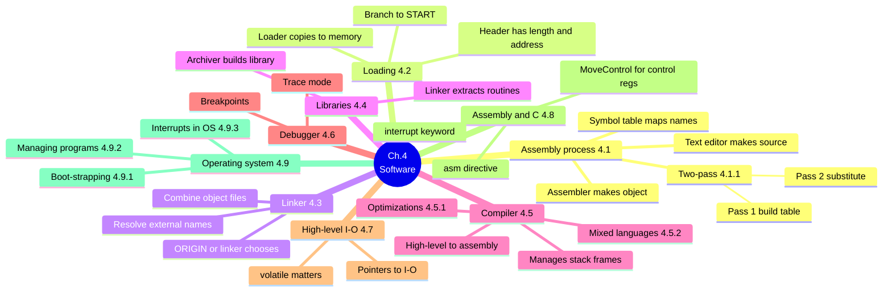
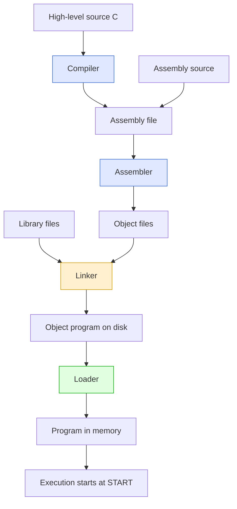
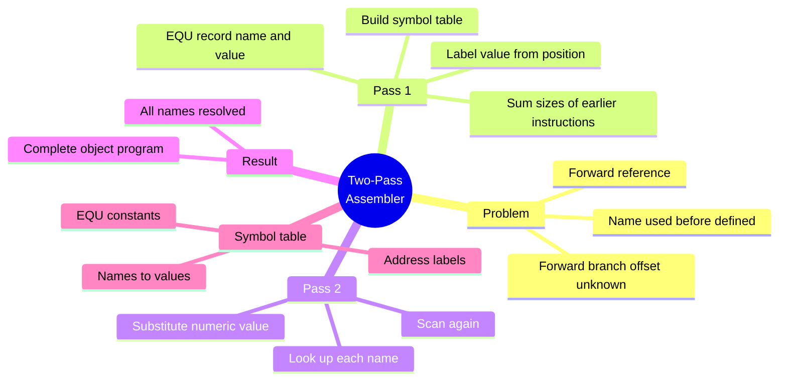
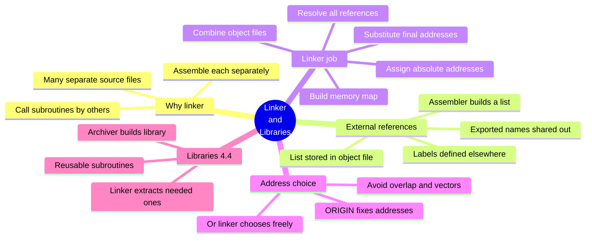
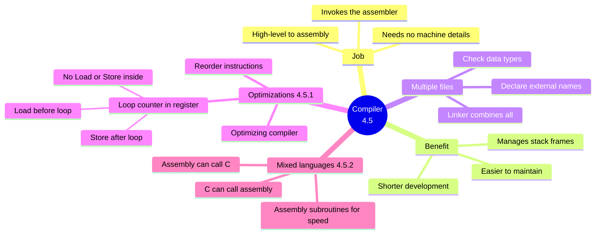
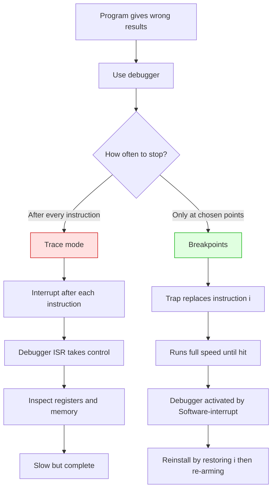
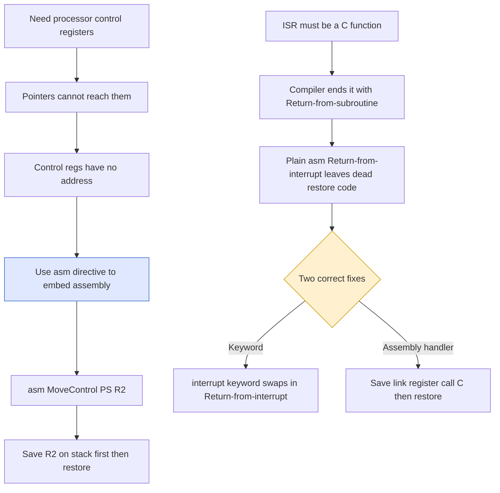
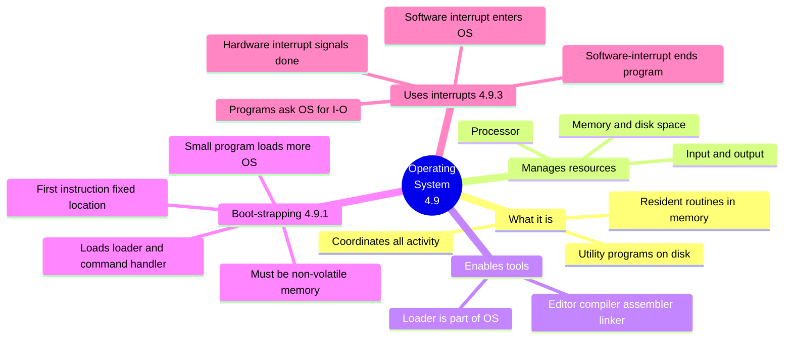
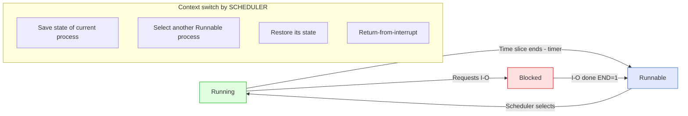

# Chapter 4 — Software · Mind Maps

**Companion to:** `Chapter4_Software_StudyGuide.md`

> **How to view these:** The diagrams below use **Mermaid**, which renders as real
> pictures in VS Code (with a Markdown Mermaid extension), Obsidian, Typora, GitHub, and
> GitLab. If you open this file somewhere that *doesn't* render Mermaid, every diagram
> also has a plain-text **ASCII** version right underneath so nothing is lost.
>
> To export as an image/PDF: open in Obsidian or Typora → Export, or paste a single
> ```mermaid``` block into https://mermaid.live and download PNG/SVG.

---

## Table of Contents
1. [Master Map — The Whole Chapter](#1-master-map--the-whole-chapter)
2. [The Toolchain Pipeline](#2-the-toolchain-pipeline)
3. [The Two-Pass Assembler](#3-the-two-pass-assembler)
4. [The Linker and Libraries](#4-the-linker-and-libraries)
5. [The Compiler and Optimization](#5-the-compiler-and-optimization)
6. [The Debugger — Trace Mode and Breakpoints](#6-the-debugger--trace-mode-and-breakpoints)
7. [Assembly and C Interaction](#7-assembly-and-c-interaction)
8. [The Operating System](#8-the-operating-system)
9. [Multitasking — Process States and Time Slicing](#9-multitasking--process-states-and-time-slicing)

---

## 1. Master Map — The Whole Chapter



**ASCII fallback:**
```
Ch.4 SOFTWARE
├── ASSEMBLY PROCESS (4.1)
│   ├── text editor → source; assembler → object program
│   ├── symbol table maps names to values
│   └── two-pass (4.1.1): pass1 build table, pass2 substitute
├── LOADING (4.2) — loader copies to memory; header=length+address; branch to START
├── LINKER (4.3) — combine object files, resolve external names, ORIGIN or linker chooses
├── LIBRARIES (4.4) — archiver builds library; linker extracts needed routines
├── COMPILER (4.5) — high-level→assembly, manages stack frames
│   ├── optimizations (4.5.1)
│   └── mixed languages (4.5.2)
├── DEBUGGER (4.6) — trace mode · breakpoints
├── HIGH-LEVEL I/O (4.7) — pointers to I/O registers; volatile matters
├── ASSEMBLY+C (4.8) — asm directive, MoveControl, interrupt keyword
└── OPERATING SYSTEM (4.9)
    ├── boot-strapping (4.9.1)
    ├── managing programs (4.9.2)
    └── interrupts in OS (4.9.3)
```

---

## 2. The Toolchain Pipeline

A **flow** map — how source becomes a running program.



**ASCII fallback:**
```
TOOLCHAIN PIPELINE
  High-level source (C) ──► COMPILER ──► assembly file ──┐
                                                         ├─► ASSEMBLER ─► object files ─┐
  Assembly source ────────────────────────────────────────┘                           │
                                           Library files ─────────────────────────────┤
                                                                                       ▼
                                                                                    LINKER
                                                                                       ▼
                                                                        Object program on disk
                                                                                       ▼
                                                                                    LOADER
                                                                                       ▼
                                                      Program in memory → execution starts at START
```

---

## 3. The Two-Pass Assembler



**ASCII fallback:**
```
TWO-PASS ASSEMBLER
├── PROBLEM: forward reference — name used before defined (forward branch offset unknown)
├── PASS 1: build symbol table
│     EQU → record name and value
│     label → value from position = sum of sizes of all earlier instructions
├── PASS 2: scan again, look up each name, substitute numeric value
└── RESULT: complete object program, all names resolved
SYMBOL TABLE = names → values (EQU constants and address labels)
```

---

## 4. The Linker and Libraries



**ASCII fallback:**
```
LINKER AND LIBRARIES
├── WHY: call subroutines by others in many separate files; assemble each separately
├── EXTERNAL REFERENCES
│     labels defined elsewhere; assembler lists them in the object file
│     exported names are shared out for others to use
├── LINKER JOB
│     combine object files → build memory map → assign absolute addresses
│     substitute final addresses → resolve all external references
├── ADDRESS CHOICE: ORIGIN fixes addresses, OR linker chooses (avoid overlap and vectors)
└── LIBRARIES (4.4): archiver builds library of reusable subroutines; linker extracts needed ones
```

---

## 5. The Compiler and Optimization



**ASCII fallback:**
```
COMPILER (4.5)
├── JOB: high-level → assembly, then invokes the assembler; no machine details needed
├── BENEFIT: manages stack frames, shorter development, easier maintenance
├── MULTIPLE FILES: declare external names → type checking; linker combines all
├── OPTIMIZATIONS (4.5.1): reorder instructions = optimizing compiler
│     loop counter in register → Load before loop, none inside, Store after loop
└── MIXED LANGUAGES (4.5.2): hand-crafted assembly for speed; C↔assembly can call each other
```

---

## 6. The Debugger — Trace Mode and Breakpoints

A **decision/comparison** flow.



**ASCII fallback:**
```
DEBUGGER (4.6)  — program gives wrong results, so stop and inspect
            How often to stop?
            │                        │
   After every instruction      Only at chosen points
            │                        │
       TRACE MODE               BREAKPOINTS
   interrupt after each         Trap replaces instruction i
   debugger ISR controls        runs full speed until hit
   inspect regs and memory      Software-interrupt activates debugger
   slow but complete            reinstall: restore i, then re-arm
                                  via trace mode or temp breakpoint at i+1
```

---

## 7. Assembly and C Interaction



**ASCII fallback:**
```
ASSEMBLY AND C INTERACTION (4.8)
ACCESS CONTROL REGISTERS
  need PS and IENABLE → pointers cannot reach them (no address)
  → use asm directive to embed assembly, e.g. asm("MoveControl PS, R2")
  → save R2 on stack first, restore after (compiler may be using it)

ISR IN C
  ISR must be a C function → compiler ends it with Return-from-subroutine
  plain asm("Return-from-interrupt") leaves dead restore code (regs/SP not restored!)
  TWO CORRECT FIXES:
    1. interrupt keyword → compiler swaps in Return-from-interrupt (not all compilers)
    2. assembly handler → save link register, call C subroutine, restore, Return-from-interrupt
```

---

## 8. The Operating System



**ASCII fallback:**
```
OPERATING SYSTEM (4.9)
├── WHAT: coordinates all activity; resident routines in memory + utilities on disk
├── MANAGES: processor · memory and disk space · input and output
├── ENABLES TOOLS: editor, compiler, assembler, linker; loader is part of OS
├── BOOT-STRAPPING (4.9.1)
│     first instruction at fixed location in NON-VOLATILE memory
│     small program loads progressively more OS → loader + command handler
└── USES INTERRUPTS (4.9.3)
      programs ask OS for I/O via software interrupt
      hardware interrupt signals I/O done; Software-interrupt ends a program
```

---

## 9. Multitasking — Process States and Time Slicing

A **state/flow** map of process states and the context switch.



**ASCII fallback:**
```
MULTITASKING — PROCESS STATES (time slicing: each program runs for τ, set by hardware timer)
   RUNNING  --time slice ends (timer)-->  RUNNABLE
   RUNNABLE --scheduler selects-------->  RUNNING
   RUNNING  --requests I/O------------->  BLOCKED
   BLOCKED  --I/O done, END=1---------->  RUNNABLE

CONTEXT SWITCH (SCHEDULER):
   1. save state of current process (regs, PC, PS)
   2. select another Runnable process
   3. restore its saved state
   4. Return-from-interrupt
OS ROUTINES: OSINIT · OSSERVICES · SCHEDULER · IOINIT · IODATA · KBDINIT · KBDDATA
```

---

*End of mind maps. Pair this with the main study guide for full detail on each node.*
