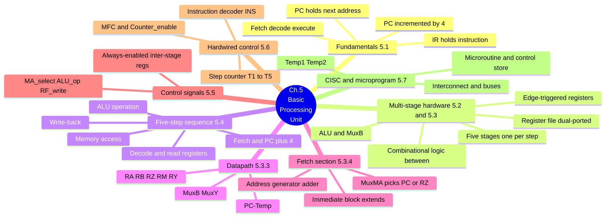
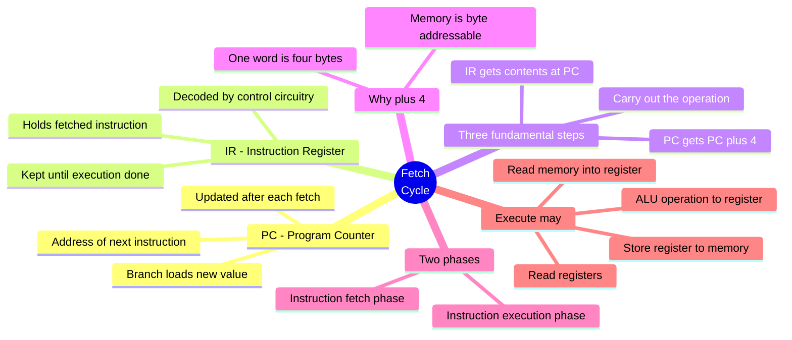
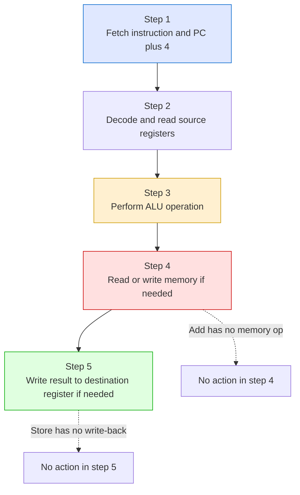
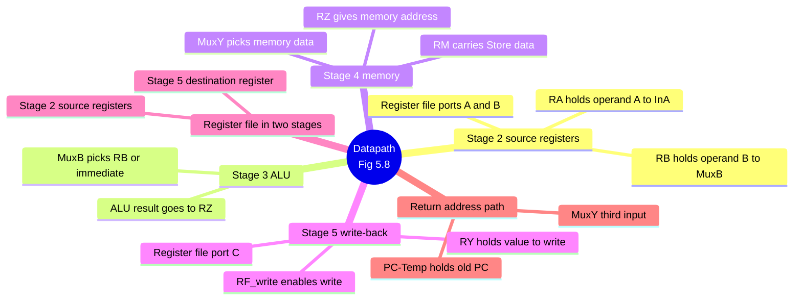
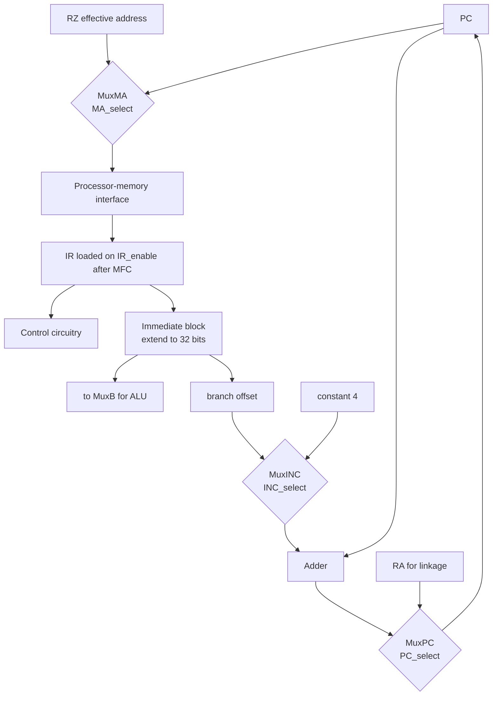
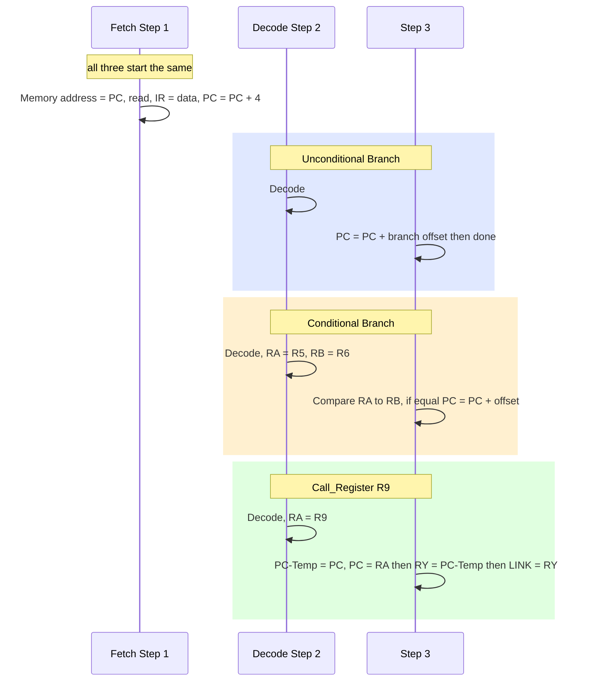
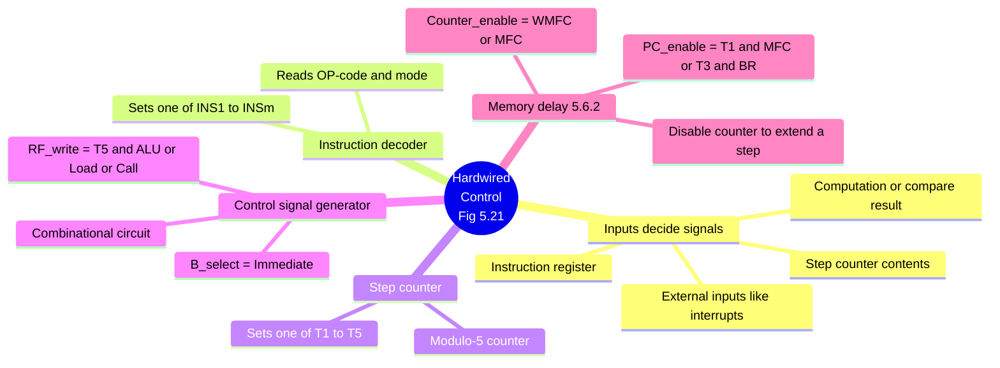
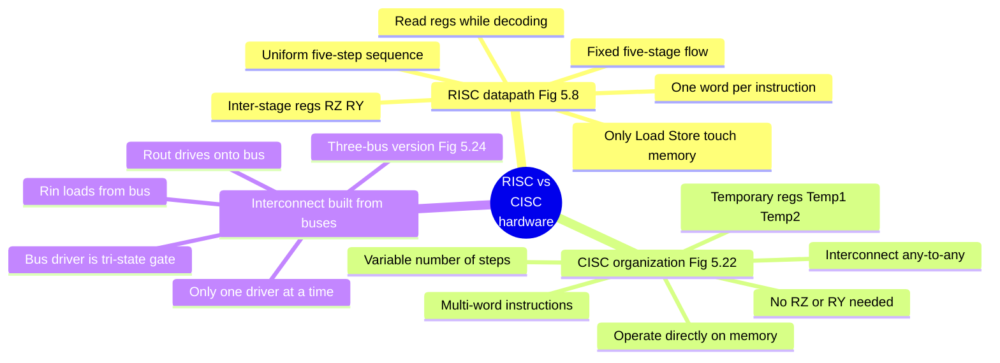
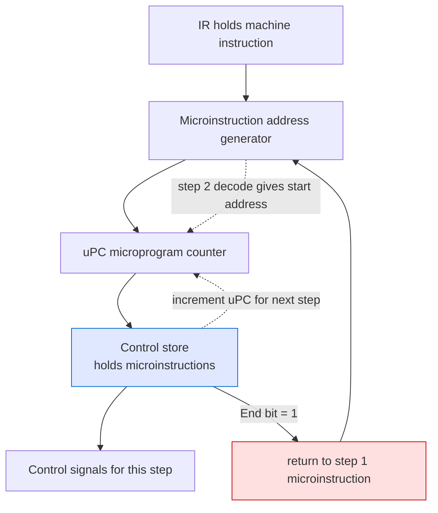

# Chapter 5 — Basic Processing Unit · Mind Maps

**Companion to:** `Chapter5_Basic_Processing_Unit_StudyGuide.md`

> **How to view these:** The diagrams below use **Mermaid**, which renders as real
> pictures in VS Code (with a Markdown Mermaid extension), Obsidian, Typora, GitHub, and
> GitLab. If you open this file somewhere that *doesn't* render Mermaid, every diagram
> also has a plain-text **ASCII** version right underneath so nothing is lost.
>
> To export as an image/PDF: open in Obsidian or Typora → Export, or paste a single
> ```mermaid``` block into https://mermaid.live and download PNG/SVG.

---

## Table of Contents
1. [Master Map — The Whole Chapter](#1-master-map--the-whole-chapter)
2. [Fundamental Concepts — PC, IR, Fetch Cycle](#2-fundamental-concepts)
3. [The Five-Step Execution Sequence](#3-the-five-step-execution-sequence)
4. [The Datapath & Its Inter-Stage Registers](#4-the-datapath--its-inter-stage-registers)
5. [Instruction Fetch Section & Address Generator](#5-instruction-fetch-section--address-generator)
6. [Branch and Call Flow](#6-branch-and-call-flow)
7. [Hardwired Control Signal Generation](#7-hardwired-control-signal-generation)
8. [RISC Datapath vs CISC Interconnect](#8-risc-datapath-vs-cisc-interconnect)
9. [Microprogrammed Control](#9-microprogrammed-control)

---

## 1. Master Map — The Whole Chapter



**ASCII fallback:**
```
Ch.5 BASIC PROCESSING UNIT
├── FUNDAMENTALS (5.1): PC=next addr · IR=instruction · fetch/decode/execute · PC+4
├── MULTI-STAGE HARDWARE (5.2/5.3): edge-triggered regs · combinational logic
│       · five stages (one per step) · dual-ported register file · ALU + MuxB
├── FIVE-STEP SEQUENCE (5.4): fetch+PC+4 · decode+read regs · ALU op · mem access · write-back
├── DATAPATH (5.3.3): RA RB RZ RM RY · PC-Temp · MuxB MuxY
├── FETCH SECTION (5.3.4): MuxMA picks PC or RZ · Immediate block extends · address-gen adder
├── CONTROL SIGNALS (5.5): inter-stage regs always enabled · MA_select · ALU_op · RF_write
├── HARDWIRED CONTROL (5.6): step counter T1..T5 · instr decoder INS · MFC + Counter_enable
└── CISC + MICROPROGRAM (5.7): Interconnect/buses · Temp1 Temp2 · microroutine + control store
```

---

## 2. Fundamental Concepts



**ASCII fallback:**
```
FETCH CYCLE
├── PC (Program Counter): address of next instruction; updated each fetch; branch loads new
├── IR (Instruction Register): holds fetched instr; decoded by control; kept until done
├── THREE FUNDAMENTAL STEPS:
│     1. IR <- [[PC]]   (fetch the word at PC into IR)
│     2. PC <- [PC] + 4 (increment: word = 4 bytes, byte-addressable)
│     3. Carry out the operation in the IR
├── TWO PHASES: instruction fetch phase · instruction execution phase
└── EXECUTE MAY: read mem->reg · read regs · ALU op->reg · store reg->mem
```

---

## 3. The Five-Step Execution Sequence

A **flow** map of the uniform RISC sequence (Figure 5.4) and how instruction types fill it.



**ASCII fallback:**
```
FIVE-STEP SEQUENCE (Figure 5.4)
  Step 1: Fetch instruction, PC <- PC + 4
  Step 2: Decode, read source registers from register file
  Step 3: Perform ALU operation
  Step 4: Read/write memory data IF a memory operand is involved
  Step 5: Write result into destination register IF needed

  Add   -> step 4 = NO ACTION (no memory operand)
  Store -> step 5 = NO ACTION (nothing to write back)
  Load  -> uses all five steps
```

---

## 4. The Datapath & Its Inter-Stage Registers



**ASCII fallback:**
```
DATAPATH (Figure 5.8)  — inter-stage registers RA RB RZ RM RY always enabled
├── STAGE 2 source regs : register file ports A,B -> RA (to InA), RB (to MuxB)
├── STAGE 3 ALU         : MuxB picks RB or immediate -> ALU -> result in RZ
├── STAGE 4 memory      : RZ = address · RM carries Store data · MuxY picks memory data
├── STAGE 5 write-back  : RY -> register file port C when RF_write asserted
├── REGISTER FILE spans stage 2 (sources) AND stage 5 (destination)
└── RETURN ADDRESS path : old PC -> PC-Temp -> RY (MuxY 3rd input) -> LINK/IRA
```

---

## 5. Instruction Fetch Section & Address Generator



**ASCII fallback:**
```
INSTRUCTION FETCH SECTION (Figures 5.9 and 5.10)
  Memory address source:
      PC ---\
             >-- MuxMA (MA_select) --> processor-memory interface --> IR (on IR_enable after MFC)
      RZ ---/
  IR feeds:  control circuitry  AND  Immediate block (extend 16-bit to 32-bit)
             Immediate -> MuxB (ALU use)  and  branch offset

  ADDRESS GENERATOR:
      input1 = PC
      input2 = MuxINC (INC_select) picks constant 4  OR  branch offset
      adder output -> MuxPC (PC_select) picks adder result OR register RA -> PC
      PC-Temp holds PC while saving a return address
```

---

## 6. Branch and Call Flow

A **sequence** map comparing the three control-transfer instructions.



**ASCII fallback:**
```
BRANCH AND CALL FLOW  (all share Step 1 fetch + PC+4)
  UNCONDITIONAL BRANCH (Fig 5.15)
     Step 2 decode
     Step 3 PC = PC + branch offset   (done; steps 4,5 no action)

  CONDITIONAL BRANCH   (Fig 5.16)  Branch_if_[R5]=[R6]
     Step 2 decode, RA = [R5], RB = [R6]
     Step 3 compare RA to RB; if equal PC = PC + offset (compare+test both in step 3)

  CALL_REGISTER R9     (Fig 5.17)
     Step 2 decode, RA = [R9]
     Step 3 PC-Temp = [PC], PC = [RA]   (jump via MuxPC input 0)
     Step 4 RY = [PC-Temp]
     Step 5 LINK = [RY]                 (return address saved)
```

---

## 7. Hardwired Control Signal Generation



**ASCII fallback:**
```
HARDWIRED CONTROL (Figure 5.21)
├── SIGNALS DEPEND ON: step counter · IR · computation/compare result · external inputs (IRQ)
├── INSTRUCTION DECODER: reads OP-code + mode, sets one of INS1..INSm
├── STEP COUNTER: sets one of T1..T5 each cycle (modulo-5 counter)
├── CONTROL SIGNAL GENERATOR (combinational):
│       RF_write = T5 . (ALU + Load + Call)
│       B_select = Immediate
└── MEMORY DELAY (5.6.2):
        Counter_enable = WMFC + MFC   (extend step by disabling counter while waiting)
        PC_enable      = T1 . MFC + T3 . BR  (increment PC once on fetch; also step 3 branches)
```

---

## 8. RISC Datapath vs CISC Interconnect



**ASCII fallback:**
```
RISC DATAPATH vs CISC INTERCONNECT
┌───────────────────────────────────┬────────────────────────────────────────┐
│ RISC datapath (Fig 5.8)            │ CISC organization (Fig 5.22)            │
├───────────────────────────────────┼────────────────────────────────────────┤
│ fixed five-stage data flow         │ Interconnect = flexible any-to-any      │
│ inter-stage regs RZ, RY            │ no RZ/RY; uses Temp1, Temp2             │
│ one word per instruction           │ instructions may span several words     │
│ only Load/Store access memory      │ instructions operate directly on memory │
│ uniform five-step sequence         │ variable number of steps per instr      │
│ read source regs while decoding    │ read regs only after partial decode     │
└───────────────────────────────────┴────────────────────────────────────────┘
Interconnect built from BUSES: driver = tri-state gate, only one drives at a time.
  Rin = load bus value into flip-flop · Rout = drive flip-flop onto bus.
  Three-bus version (Fig 5.24): buses A, B feed ALU; bus C returns the result.
```

---

## 9. Microprogrammed Control



**ASCII fallback:**
```
MICROPROGRAMMED CONTROL (Figure 5.27)
  IR --> microinstruction address generator --> uPC --> control store --> control signals

  - control store (a.k.a. microprogram memory): on-chip, holds microinstructions
  - microinstruction = control word = n bits, one bit per control signal, for one step
  - microroutine = sequence of microinstructions for one machine instruction
  - steps 1,2 (fetch, decode) common to all; instruction-specific routine starts at step 3
  - step 2: decode IR -> starting address loaded into uPC
  - execution: increment uPC to read successive microinstructions
  - End bit = 1 -> address generator jumps back to step-1 microinstruction (fetch next)

  Trade-off: microprogrammed = flexible but slower; hardwired = faster, preferred for RISC.
```

---

*End of mind maps. Pair this with the main study guide for full detail on each node.*
