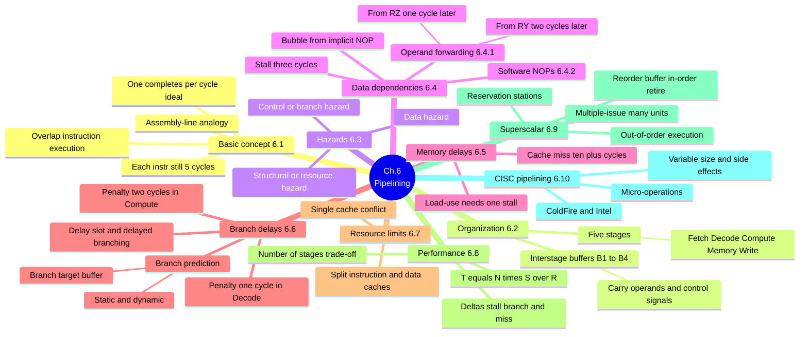
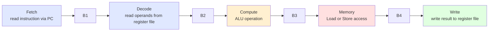
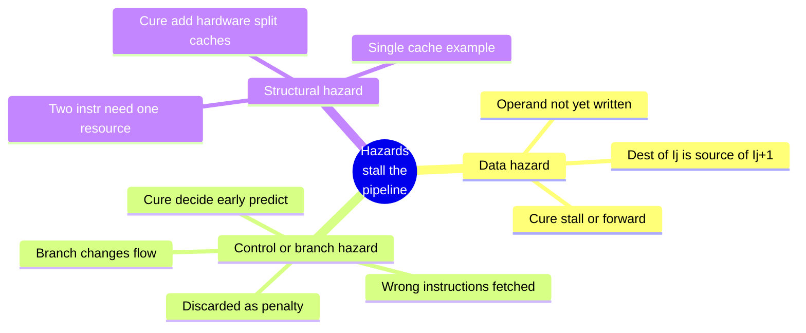
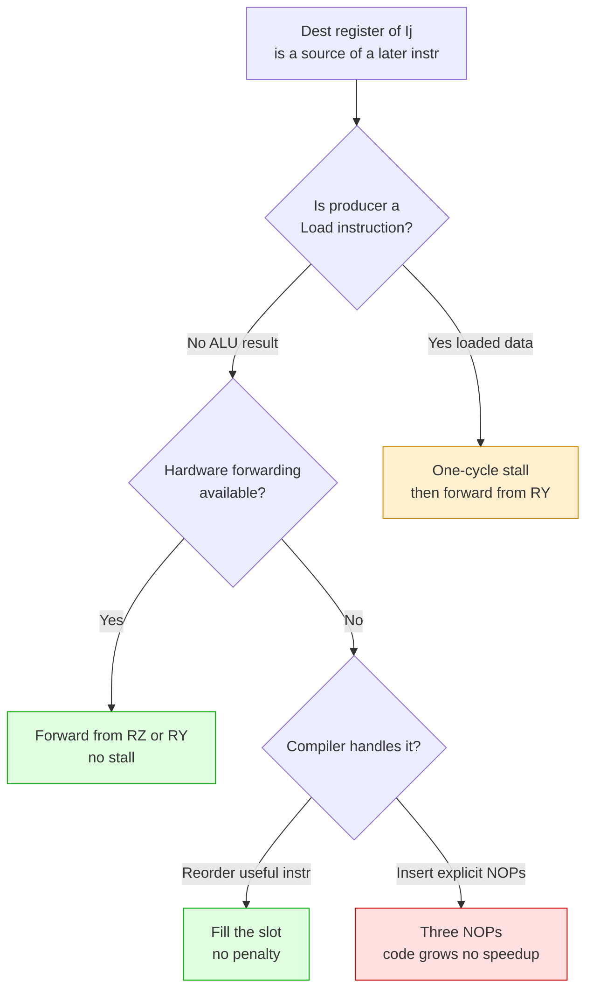
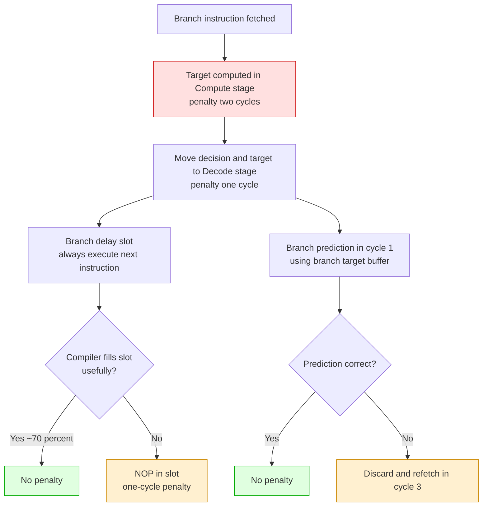
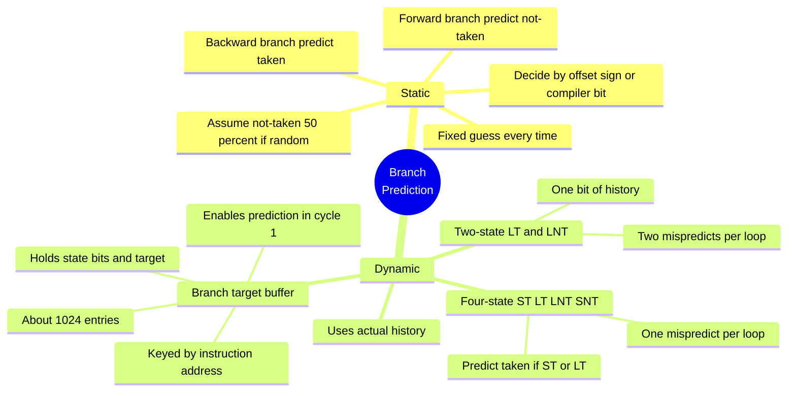
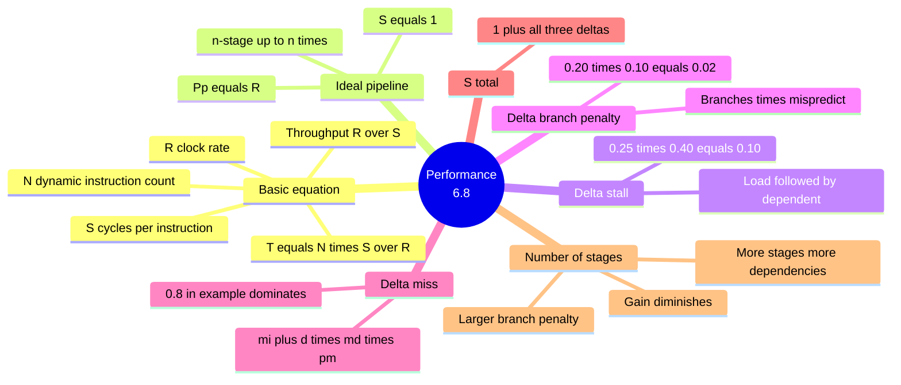
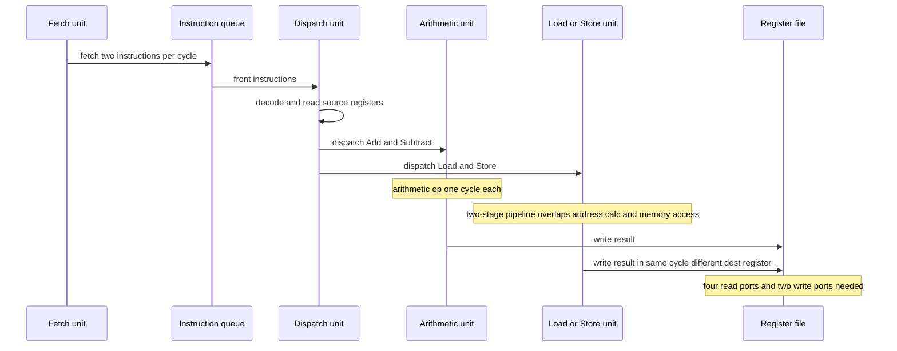
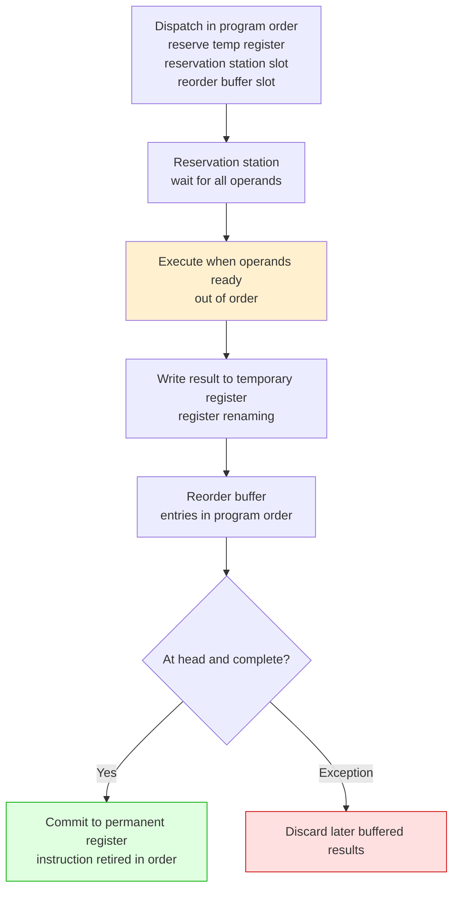

# Chapter 6 — Pipelining · Mind Maps

**Companion to:** `Chapter6_Pipelining_StudyGuide.md`

> **How to view these:** The diagrams below use **Mermaid**, which renders as real
> pictures in VS Code (with a Markdown Mermaid extension), Obsidian, Typora, GitHub, and
> GitLab. If you open this file somewhere that *doesn't* render Mermaid, every diagram
> also has a plain-text **ASCII** version right underneath so nothing is lost.
>
> To export as an image/PDF: open in Obsidian or Typora → Export, or paste a single
> ```mermaid``` block into https://mermaid.live and download PNG/SVG.

---

## Table of Contents
1. [Master Map — The Whole Chapter](#1-master-map--the-whole-chapter)
2. [The Five-Stage Pipeline & Interstage Buffers](#2-the-five-stage-pipeline--interstage-buffers)
3. [The Three Hazard Families](#3-the-three-hazard-families)
4. [Data Dependency — Stall vs Forwarding (decision)](#4-data-dependency--stall-vs-forwarding)
5. [Branch Handling — Reducing the Penalty (flow)](#5-branch-handling--reducing-the-penalty)
6. [Branch Prediction States](#6-branch-prediction-states)
7. [Performance Equation & the Three Deltas](#7-performance-equation--the-three-deltas)
8. [Superscalar Pipeline Flow (sequence)](#8-superscalar-pipeline-flow)
9. [Out-of-Order Execution with In-Order Retirement](#9-out-of-order-execution-with-in-order-retirement)

---

## 1. Master Map — The Whole Chapter



**ASCII fallback:**
```
Ch.6 PIPELINING
├── BASIC CONCEPT (6.1): overlap execution; assembly-line analogy;
│       each instr still 5 cycles, one COMPLETES per cycle (ideal)
├── ORGANIZATION (6.2): 5 stages (Fetch Decode Compute Memory Write);
│       interstage buffers B1..B4 carry operands + control signals
├── HAZARDS (6.3): data · control/branch · structural/resource
├── DATA DEPENDENCIES (6.4): 3-cycle stall; bubble = implicit NOP
│       ├── Operand forwarding (6.4.1): from RZ (1 cycle) or RY (2 cycles)
│       └── Software NOPs (6.4.2): compiler inserts 3 NOPs or reorders
├── MEMORY DELAYS (6.5): cache miss 10+ cycles; Load-use = 1 stall
├── BRANCH DELAYS (6.6): penalty 2 cyc in Compute, 1 cyc in Decode;
│       delay slot + delayed branching; prediction (static/dynamic + BTB)
├── RESOURCE LIMITS (6.7): single-cache conflict → split I-cache / D-cache
├── PERFORMANCE (6.8): T = N*S/R; deltas (stall, branch, miss); #stages trade-off
├── SUPERSCALAR (6.9): multiple-issue, many units, reservation stations,
│       out-of-order execution, reorder buffer → in-order retirement
└── CISC PIPELINING (6.10): variable size + side effects; micro-ops; ColdFire & Intel
```

---

## 2. The Five-Stage Pipeline & Interstage Buffers



**ASCII fallback:**
```
FIVE-STAGE PIPELINE  (buffers latch state between stages)
 Fetch --B1--> Decode --B2--> Compute --B3--> Memory --B4--> Write
   |            |              |               |              |
 read via PC  read operands  ALU op         Load/Store     write-back
              from reg file                 access          to reg file

BUFFER CONTENTS
  B1: fetched instruction
  B2: operands, source/dest register IDs, immediate, incremented PC, control signals
  B3: ALU result (RZ) or address / store data / incremented PC
  B4: value to write back (ALU result, memory result, or incremented PC)
```

---

## 3. The Three Hazard Families



**ASCII fallback:**
```
HAZARDS = any condition that stalls the pipeline
├── DATA HAZARD      : operand not yet written (dest of Ij is source of Ij+1)
│                      cure → stall or operand forwarding
├── CONTROL/BRANCH   : branch changes flow → wrongly fetched instr discarded (penalty)
│                      cure → decide branch early, branch prediction
└── STRUCTURAL       : two instr need the same resource in one cycle (single cache)
                       cure → add hardware, split instruction and data caches
```

---

## 4. Data Dependency — Stall vs Forwarding

A **decision/comparison** map — how to resolve a data dependency.



**ASCII fallback:**
```
          Dest of Ij is a source of a later instruction
                              │
                 Is the producer a LOAD?
                   │                      │
                  No (ALU result)        Yes (loaded data)
                   │                      │
        HW forwarding available?     ONE-CYCLE STALL, then forward from RY
          │               │
         Yes             No
          │               │
    FORWARD from       Compiler handles it?
    RZ or RY            │                     │
    (no stall)      reorder useful instr   insert explicit NOPs
                    → fill slot, no penalty → 3 NOPs, code grows, no speedup

KEY: RZ = ALU result 1 cycle later · RY = result 2 cycles later (or Load data in RY)
```

---

## 5. Branch Handling — Reducing the Penalty

A **flow** map showing how each technique cuts the branch penalty.



**ASCII fallback:**
```
BRANCH PENALTY REDUCTION (step by step)
 1. Target computed in COMPUTE stage ............... penalty = 2 cycles
 2. Move decision + target to DECODE stage ........ penalty = 1 cycle
 3. BRANCH DELAY SLOT: always execute next instruction
       └─ compiler fills it usefully ~70% of the time → NO penalty
       └─ else NOP in slot ............................ 1-cycle penalty
 4. BRANCH PREDICTION in cycle 1 (branch target buffer)
       └─ prediction correct ......................... NO penalty
       └─ prediction wrong ........................... discard + refetch cycle 3
```

---

## 6. Branch Prediction States



**ASCII fallback:**
```
BRANCH PREDICTION
├── STATIC (same guess every time)
│     - assume not-taken → 50% if random
│     - backward branch (loop end) → predict TAKEN
│     - forward branch (loop start) → predict NOT-TAKEN
│     - chosen by offset sign or a compiler-set bit
└── DYNAMIC (uses actual history)
      ├── 2-state: LT / LNT (1 history bit) → 2 mispredicts per loop (first + last pass)
      ├── 4-state: ST LT LNT SNT; predict TAKEN if ST or LT → 1 mispredict per loop
      └── BRANCH TARGET BUFFER: table keyed by instr address, holds state bits + target,
            ~1024 entries, enables prediction in CYCLE 1 (while branch is fetched)
```

---

## 7. Performance Equation & the Three Deltas



**ASCII fallback:**
```
PERFORMANCE (6.8)
  BASIC EQUATION:  T = (N * S) / R    throughput = R / S
     N = dynamic instruction count · S = cycles/instr · R = clock rate
  IDEAL PIPELINE:  S = 1, Pp = R; n-stage pipeline → up to n times throughput

  INCREMENTS to S (added to ideal 1), independent and additive:
    delta_stall          = 0.25 * 0.40 * 1 = 0.10   (Load followed by dependent)
    delta_branch_penalty = 0.20 * 0.10 * 1 = 0.02   (branches * mispredict rate)
    delta_miss           = (mi + d*md) * pm = (0.05 + 0.30*0.10)*10 = 0.8  ← DOMINATES
    S total = 1 + delta_stall + delta_branch_penalty + delta_miss

  NUMBER OF STAGES: more stages → more dependencies + bigger branch penalty
                    → gain diminishes; ALU delay sets the cycle-time floor
```

---

## 8. Superscalar Pipeline Flow

A **sequence/flow** map — the four-instruction example of Figure 6.14.



**ASCII fallback:**
```
SUPERSCALAR FLOW (Figure 6.14 example)
  Fetch unit ──(2 instr/cycle)──> Instruction queue ──> Dispatch unit
       Dispatch unit decodes, reads source registers, then sends:
         → Arithmetic unit  : Add, Subtract   (one cycle each)
         → Load/Store unit  : Load, Store      (two-stage pipeline:
                                                overlaps address calc with
                                                previous memory access)
       Results written to register file (two write ports, four read ports)
       Two results may write same cycle IF destination registers differ
```

---

## 9. Out-of-Order Execution with In-Order Retirement



**ASCII fallback:**
```
OUT-OF-ORDER EXECUTION, IN-ORDER RETIREMENT
  1. DISPATCH (program order): reserve a temporary register,
       a reservation-station slot, and a reorder-buffer slot
  2. RESERVATION STATION: instruction waits until ALL operands arrive
       (results broadcast with register-ID tags; matching tag copies value in)
  3. EXECUTE when operands ready → OUT OF ORDER
  4. Write result to a TEMPORARY register (register renaming)
  5. REORDER BUFFER holds entries in PROGRAM ORDER
  6. When an entry reaches the HEAD and is complete → COMMIT to the
       permanent register; instruction is RETIRED (in order)
       └─ on an EXCEPTION: discard later buffered results safely
  RESULT: instructions complete out of order but RETIRE in program order
          (gives precise exceptions; in-order dispatch avoids deadlock)
```

---

*End of mind maps. Pair this with the main study guide for full detail on each node.*
