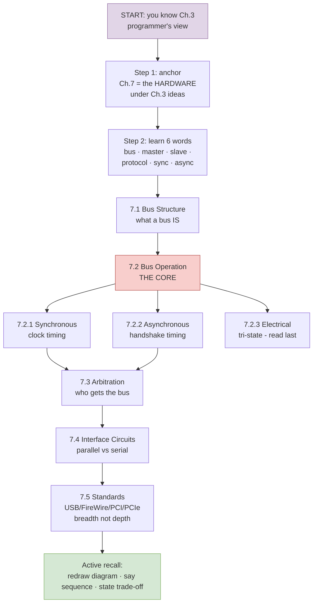
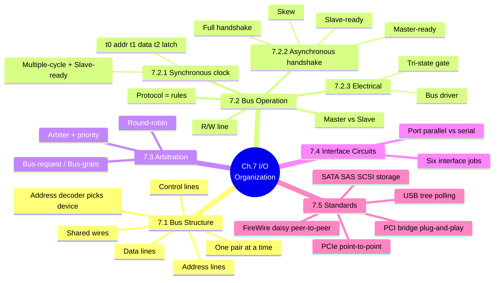
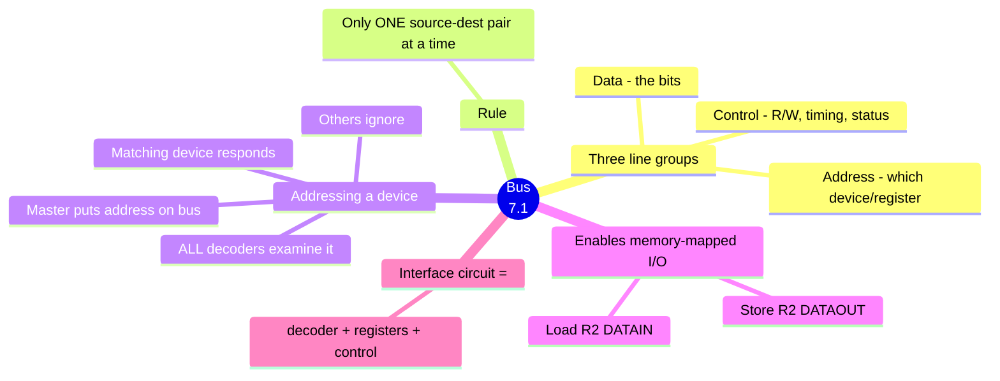
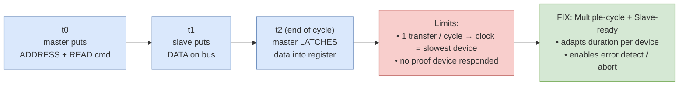
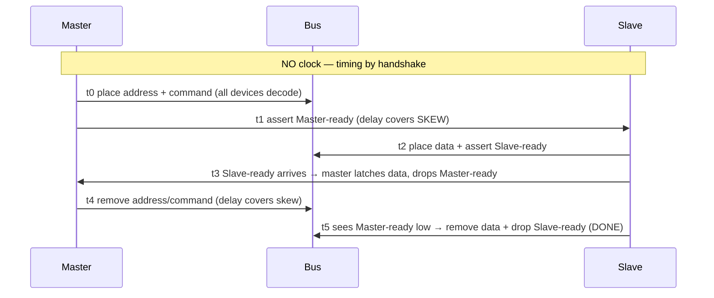
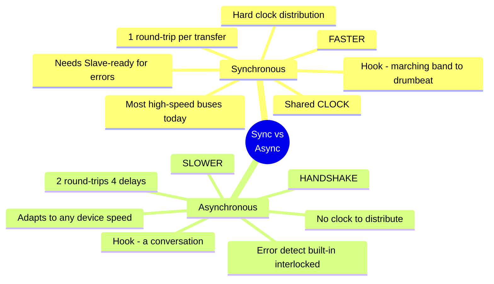
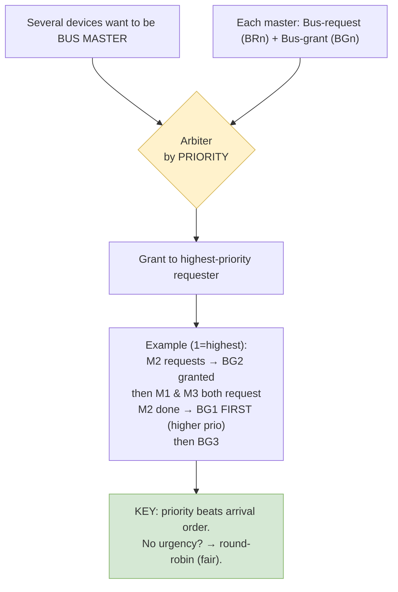
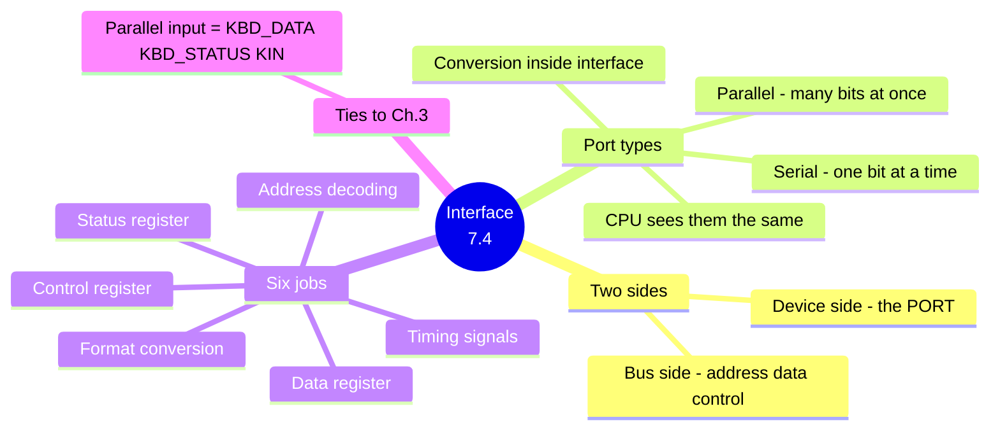
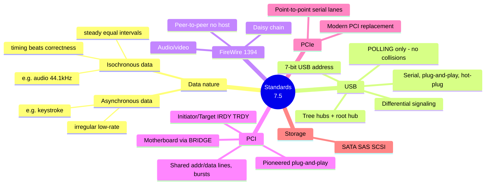

# Chapter 7 — Input/Output Organization · Mind Maps

**Companion to:** `Chapter7_Input_Output_Organization_StudyGuide.md`

> View with any Mermaid-capable tool (VS Code + Mermaid extension, Obsidian, Typora,
> GitHub). Each diagram also has a plain-text ASCII fallback. Export a single ```mermaid```
> block to PNG/SVG at https://mermaid.live.

---

## Table of Contents
1. [How to Start Learning (the path)](#1-how-to-start-learning--the-path)
2. [Master Map — The Whole Chapter](#2-master-map--the-whole-chapter)
3. [Bus Structure](#3-bus-structure)
4. [Synchronous Bus (timing)](#4-synchronous-bus)
5. [Asynchronous Handshake (flow)](#5-asynchronous-handshake)
6. [Synchronous vs Asynchronous](#6-synchronous-vs-asynchronous)
7. [Arbitration](#7-arbitration)
8. [Interface Circuits](#8-interface-circuits)
9. [Interconnection Standards](#9-interconnection-standards)

---

## 1. How to Start Learning — the path



**ASCII fallback:**
```
HOW TO START
START (you know Ch.3 programmer's view)
  └─ Step 1: anchor — Ch.7 is the HARDWARE under Ch.3 ideas
      └─ Step 2: learn 6 words (bus·master·slave·protocol·sync·async)
          └─ 7.1 Bus Structure (what a bus is)
              └─ 7.2 Bus Operation  ← THE CORE
                   ├─ 7.2.1 Synchronous (clock)
                   ├─ 7.2.2 Asynchronous (handshake)
                   └─ 7.2.3 Electrical (tri-state, read last)
                        └─ 7.3 Arbitration (who gets the bus)
                             └─ 7.4 Interface Circuits (parallel vs serial)
                                  └─ 7.5 Standards (USB/FireWire/PCI/PCIe — breadth)
                                       └─ ACTIVE RECALL: redraw · say sequence · state trade-off
```

---

## 2. Master Map — The Whole Chapter



**ASCII fallback:**
```
Ch.7 I/O ORGANIZATION
├── 7.1 BUS STRUCTURE: shared wires (address+data+control), 1 pair at a time, address decoder
├── 7.2 BUS OPERATION
│   ├── protocol=rules · R/W line · master vs slave
│   ├── 7.2.1 Synchronous (clock): t0 addr → t1 data → t2 latch; multiple-cycle + Slave-ready
│   ├── 7.2.2 Asynchronous (handshake): Master-ready/Slave-ready, skew, full handshake
│   └── 7.2.3 Electrical: bus driver, tri-state gate (high-Z)
├── 7.3 ARBITRATION: arbiter + priority, Bus-request/Bus-grant, round-robin
├── 7.4 INTERFACE CIRCUITS: port parallel vs serial; six interface jobs
└── 7.5 STANDARDS: USB(tree,polling) · FireWire(daisy,peer) · PCI(bridge,PnP) · PCIe · SATA/SAS/SCSI
```

---

## 3. Bus Structure



**ASCII fallback:**
```
BUS STRUCTURE (7.1)
├── THREE LINE GROUPS: Address(which) · Data(bits) · Control(R/W,timing,status)
├── RULE: only ONE source→dest pair at a time
├── ADDRESSING: master puts address → ALL decoders check → matching device responds
├── ENABLES memory-mapped I/O: Load R2,DATAIN / Store R2,DATAOUT
└── INTERFACE CIRCUIT = address decoder + data/status/control registers + control logic
```

---

## 4. Synchronous Bus

A **timing** map — the three instants of a read.



**ASCII fallback:**
```
SYNCHRONOUS BUS (shared clock)
  t0 → master puts ADDRESS + READ command
  t1 → slave puts DATA on bus
  t2 → master LATCHES data (end of cycle)
  constraints: pulse width > propagation delay + decode time; t2-t1 > prop + setup time

  LIMITS: 1 transfer/cycle → clock forced to slowest device; no proof of response
  FIX   : Multiple-cycle transfer + Slave-ready ack
          → duration adapts per device · error detect (abort if no response)
```

---

## 5. Asynchronous Handshake

A **sequence/flow** map — the 6 instants (Figure 7.6, input).



**ASCII fallback:**
```
ASYNCHRONOUS HANDSHAKE (no clock; input, Fig 7.6)
 t0  master puts ADDRESS + COMMAND (all devices decode)
 t1  master asserts MASTER-READY   (delay t1-t0 covers bus SKEW)
 t2  slave puts DATA + asserts SLAVE-READY
 t3  Slave-ready reaches master → master LATCHES data, drops Master-ready
 t4  master removes address/command (delay covers skew)
 t5  slave sees Master-ready low → removes data + drops Slave-ready → DONE
 Fully interlocked = each change responds to the other = highest reliability.
```

---

## 6. Synchronous vs Asynchronous



**ASCII fallback:**
```
SYNC vs ASYNC
┌───────────────────────────────┬────────────────────────────────────┐
│ SYNCHRONOUS (clock)            │ ASYNCHRONOUS (handshake)           │
├───────────────────────────────┼────────────────────────────────────┤
│ 1 round-trip/transfer → FASTER │ 2 round-trips (4 delays) → SLOWER  │
│ clock distribution is HARD     │ no clock needed                    │
│ needs Slave-ready for errors   │ error-detect built in (interlocked)│
│ used by most high-speed buses  │ adapts to any device speed         │
│ hook: marching band to drum    │ hook: a two-way conversation       │
└───────────────────────────────┴────────────────────────────────────┘
```

---

## 7. Arbitration



**ASCII fallback:**
```
ARBITRATION (7.3)
Several devices want to be BUS MASTER → ARBITER decides by PRIORITY
Each master has: Bus-request (BRn) + Bus-grant (BGn)
EXAMPLE (1=highest): M2 requests→BG2; then M1&M3 request; M2 done→BG1 FIRST→then BG3
KEY: priority beats arrival order. No urgency → round-robin (fair rotation).
```

---

## 8. Interface Circuits



**ASCII fallback:**
```
INTERFACE CIRCUITS (7.4)
├── TWO SIDES: bus side (addr/data/ctrl)  |  device side = the PORT
├── PORT TYPES: parallel (many bits at once) vs serial (one bit); conversion inside; CPU sees same
├── SIX JOBS: data reg · status reg · control reg · address decode · timing · format conversion
└── TIES TO Ch.3: the parallel input interface = the KBD_DATA/KBD_STATUS/KIN hardware
```

---

## 9. Interconnection Standards



**ASCII fallback:**
```
INTERCONNECTION STANDARDS (7.5)
├── DATA NATURE:
│    • Asynchronous data = irregular/low-rate (keystroke)
│    • Isochronous data  = steady equal intervals (audio 44.1kHz); timing > correctness
├── USB      : tree (hubs+root), serial, plug&play, hot-plug, POLLING-only, 7-bit addr, differential
├── FireWire : daisy chain, PEER-TO-PEER (no host), audio/video (IEEE 1394)
├── PCI      : motherboard via BRIDGE, pioneered plug&play, shared addr/data lines, bursts (initiator/target)
├── PCIe     : point-to-point serial lanes, modern PCI replacement
└── STORAGE  : SATA / SAS / SCSI
```

---

*End of mind maps. Pair with the study guide for full detail.*
